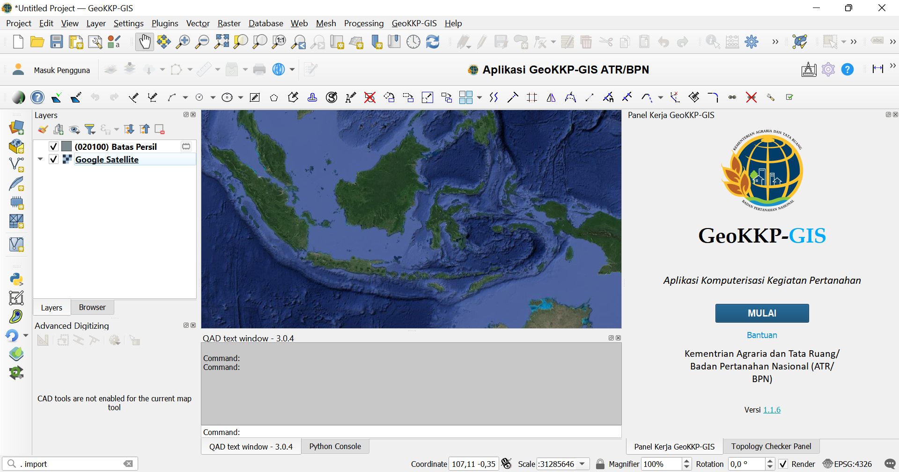

---
# Feel free to add content and custom Front Matter to this file.
# To modify the layout, see https://jekyllrb.com/docs/themes/#overriding-theme-defaults

layout: home
title: Home
nav_order: 1
description: "Halaman Pengantar"
permalink: /
---

# Manual Aplikasi GeoKKP-GIS

Aplikasi GeoKKP digunakan oleh Kementrian Agraria dan Tata Ruang/Badan Pertanahan Nasional (ATR/BPN) dalam kegiatan pemetaan sehari-hari untuk berbagai keperluan di bidang pertanahan. GeoKKP dibangun pada perangkat lunak AutoCAD sebagai aplikasi yang banyak digunakan di setiap kantor pertanahan di seluruh Indonesia untuk melakukan editing, pengecekan topologi, input data, validasi, pembuatan layout peta, dan kegiatan 

GeoKKP-GIS adalah plugin QGIS yang digunakan dalam kegiatan pemetaan pertanahan yang dilakukan oleh Kementrian Agraria dan Tata Ruang/Badan Pertanahan Nasional (ATR/BPN) untuk keperluan pengolahan data dan pembuatan peta dari hasil akuisisi data di lapangan. Plugin ini menduplikasi fitur-fitur pemetaan yang dimiliki oleh GeoKKP yang sebelumnya digunakan pada perangkat CAD. GeoKKP-GIS bersifat *open-source*, dengan pengembangan yang difokuskan pada kemudahan penggunaan perangkat oleh pegawai di kantor pertanahan. 

Versi PDF dari dokumen ini dapat diunduh pada 
                                                        
